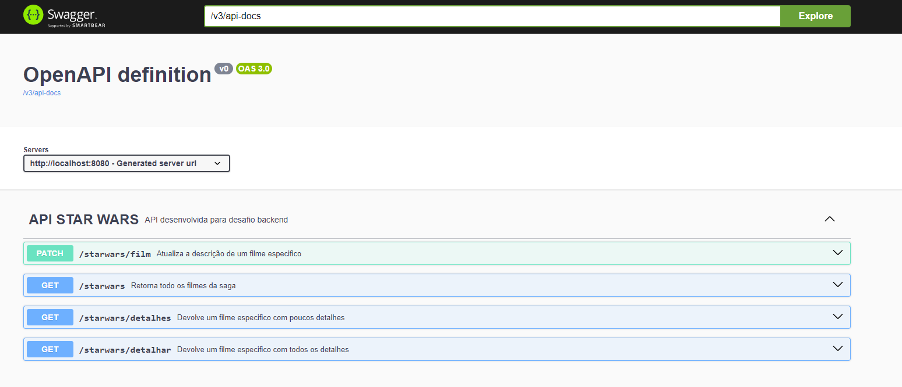

# starwars-api

Este projeto consiste em atender a alguns requisitos de um desafio backend, onde, utilizando de dados da API Star Wars [SWAPI.DEV](https://swapi.dev/):

Para executar o projeto no terminal, esteja na pasta raiz do projeto e digite o seguinte comando:

```
mvn spring-boot:run 
```

* Para ver todas as operações do serviço basta acessar o endereço do swagger:
    ```
    http://localhost:8080/swagger-ui/index.html
    ```
* Você vera uma tela como essa:
  